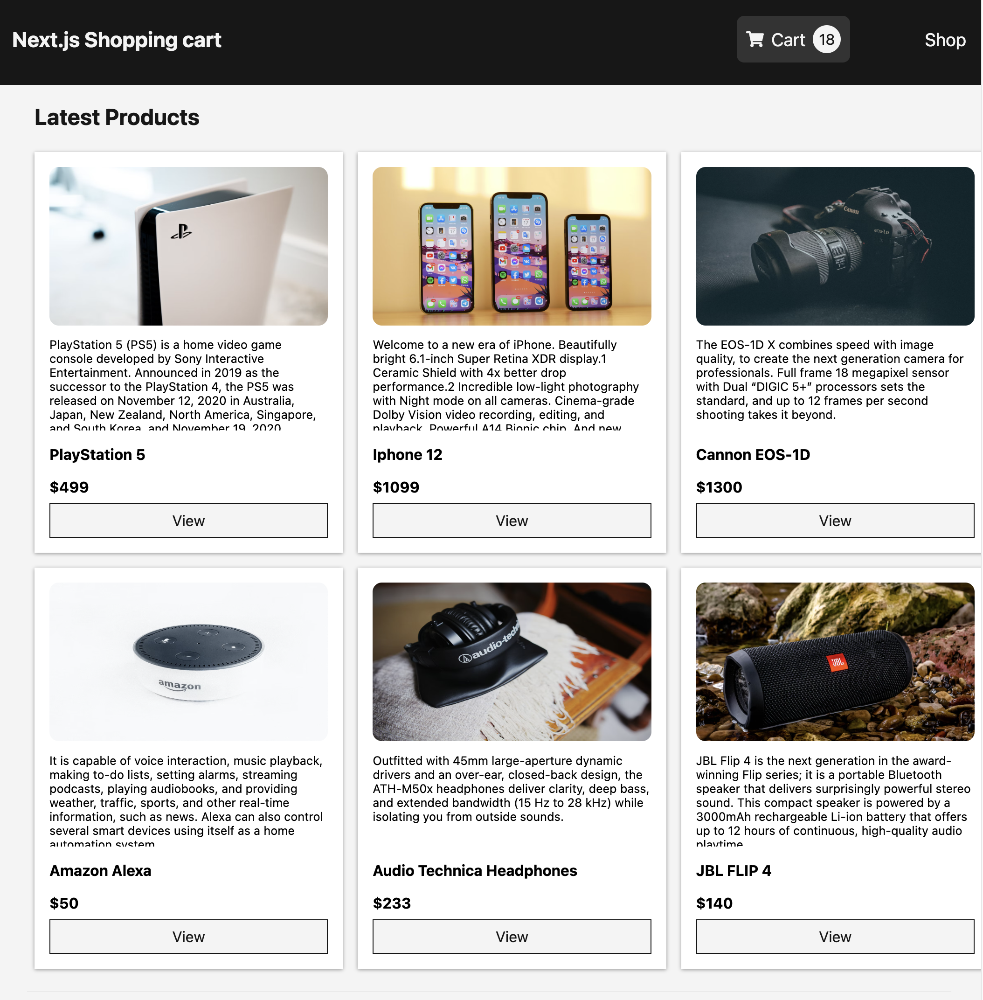

This is a [Next.js](https://nextjs.org/) project bootstrapped with [`create-next-app`](https://github.com/vercel/next.js/tree/canary/packages/create-next-app),

- GraphQL with ApolloServer/Client.
- Local state management with ApolloClient's ReactiveVariable.

[View Deom page](https://nextjs-shopping-cart-n6t81ze2a-sunyrora.vercel.app/)

[](https://62b5a6d7ca5cd90080189357--keen-truffle-fc8264.netlify.app/)

## Getting Started

1. create **`.env`** or **`.env.development`** file in the project `root` and define variables like example below.

```

NODE_ENV='development'
PORT=3000 # any port number you want
GRAPH_URI=http://localhost:${PORT}/api/graphql

```

This <mark>**GRAPH_URI**</mark> will be the graphql endpoint.
It's for the development, when you deploy it on a host server, set **`GRAPH_URI`** environment variable to the hosted adress on your hosting service site like below.

> [YOUR HOST ADRESS]**/api/graphql**

2. rund this command below on your console

```bash
npm install

npm run dev
```

Open [http://localhost:3000](http://localhost:3000) with your browser to see the result.

> Port number will be the [PORT] defined in the `.env` file.

\
<br>
---

You can start editing the page by modifying `pages/index.js`. The page auto-updates as you edit the file.

[API routes](https://nextjs.org/docs/api-routes/introduction) can be accessed on [http://localhost:3000/api/hello](http://localhost:3000/api/hello). This endpoint can be edited in `pages/api/hello.js`.

The `pages/api` directory is mapped to `/api/*`. Files in this directory are treated as [API routes](https://nextjs.org/docs/api-routes/introduction) instead of React pages.

## Learn More

To learn more about Next.js, take a look at the following resources:

- [Next.js Documentation](https://nextjs.org/docs) - learn about Next.js features and API.
- [Learn Next.js](https://nextjs.org/learn) - an interactive Next.js tutorial.

You can check out [the Next.js GitHub repository](https://github.com/vercel/next.js/) - your feedback and contributions are welcome!

## Deploy on Vercel

The easiest way to deploy your Next.js app is to use the [Vercel Platform](https://vercel.com/new?utm_medium=default-template&filter=next.js&utm_source=create-next-app&utm_campaign=create-next-app-readme) from the creators of Next.js.

Check out our [Next.js deployment documentation](https://nextjs.org/docs/deployment) for more details.
